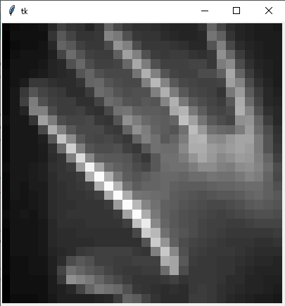

# ADNS3080 - frame Capture
This repo contains an __arduino program__, a __python script__, and a __processing sketch__ to render the output of an ADNS3080 mouse sensor as a grayscale image. This is ideal for focusing the lens as its obvious when an image is blurry. Doing so greatly improves the SQUAL value and subsequent motion detection. 

All the files work in conjunction and must have the same __baud rate__ and __begin character__. This last value controls when the python script/processing sketch receives information from the arduino. 

A properly focused camera should produce these images:

  

## How to use
Upload the arduino program to your board of choice and connect the board to the ADN3080. Afterwords, run _either_ the python script _or_ the processing sketch. 

- Use the processing IDE to run the sketch.

- If using linux, the python script can be executed by opening a terminal in the location of the python script and running the command: 

```
python3 adns3080_pixel_view.py
```

__NOTE__: While the Arduino program was written for an Arduino Uno/Nano, it should work with other boards without much issue.

## Requirements

- The Arduino sketch makes use of the [ADNS3080 library](https://github.com/RCmags/ADNS3080). 

If using Python:
- The python script uses __python 3__ 
- The script requires the [pyserial](https://pythonhosted.org/pyserial/pyserial.html#overview) library. 
- The script requires the [tkinter](https://www.pythonguis.com/installation/install-tkinter-linux/) library.

If using processing:
- [The Processing IDE software](https://processing.org/download)

## References

Credit goes to [Lauszus](https://github.com/Lauszus/ADNS3080) for the inspiration. The script is largely based on his work.
